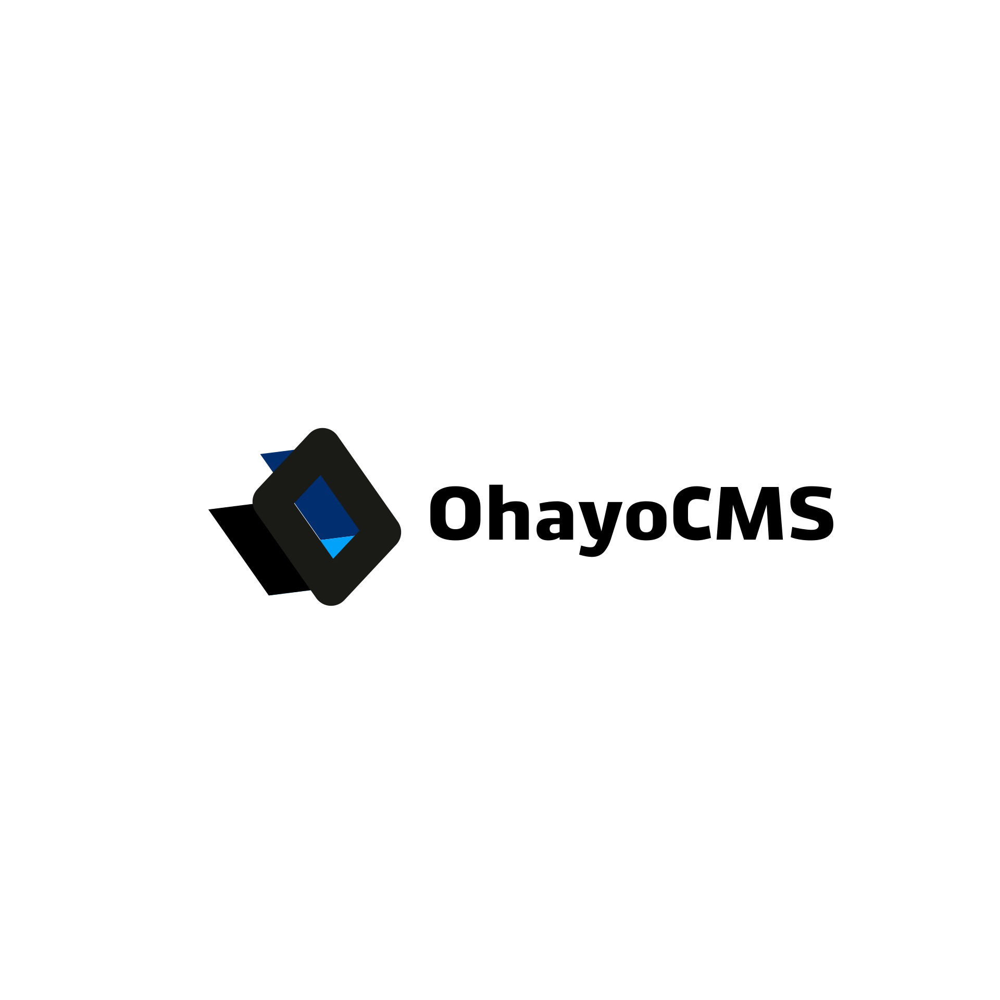

### OhayoCMS - система управления игровым порталом
- [Требования](#требования)
- [Установка](#установка)
- [Возможности](#возможности)
- [Технологии](#технологии)
- [Скриншоты](#скриншоты)

## Требования
- [Docker ^19.03.6](https://docs.docker.com/get-docker/)
- [Docker compose ^1.17.1](https://docs.docker.com/compose/install/)
- Make

## Установка
1. Склонируйте репозиторий в удобную вам директорию
2. Установите необходимые данные в docker-compose в разделе mysql
3. Скопируйте файл `src/.env.example` в `src/.env`
4. Настройте файл `src/.env` введя корректные данные базы данных
5. Напишите в корне `make`
6. Поздравляю! Вы установили cms, теперь вам необходимо зарегистрироваться на сайте и добавить админа.

## Возможности
* Администратор
  * Добавление/удаление и редактирование игровых серверов
  * Добавление/удаление и редактирование новостей
  * Управление пользователями портала
  * Управление магазином
  * Установка расширений OhayoCMS
* Игрок
  * Личный кабинет с полной статистикой
  * Персональный баланс в разных валютах (Рубли, кредиты, время в игре и т.д.)
  * Покупка предметов в магазине
  * Комментарии к новостям
  * Лайки к новостям
* Интеграции
  * SourceBans
  * VIP (Riko и WS)
  * Shop (Fork)
  * FPS и Level Ranks
  
## Технологии
В OhayoCMS в качестве основной технологии использован фреймворк Laravel 8 с официальным компонентом Jetstream для личного кабинета игрока.
[Jetstream](https://jetstream.laravel.com/1.x/introduction.html) используется в сочетании с [inertiajs](https://inertiajs.com/), которая в свою очередь позволяет писать Single Page Applications без API.
 
Мы дружим с Docker.

## Скриншоты
tbd...